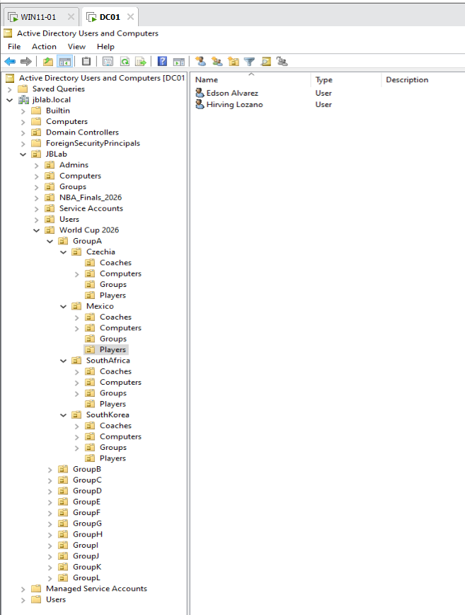
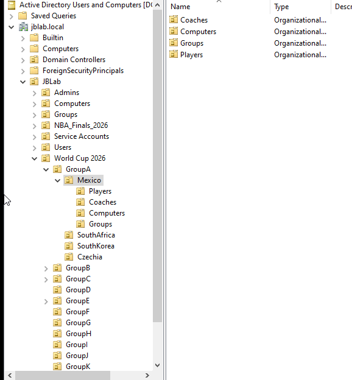
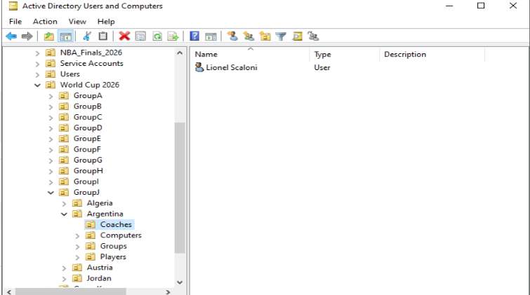
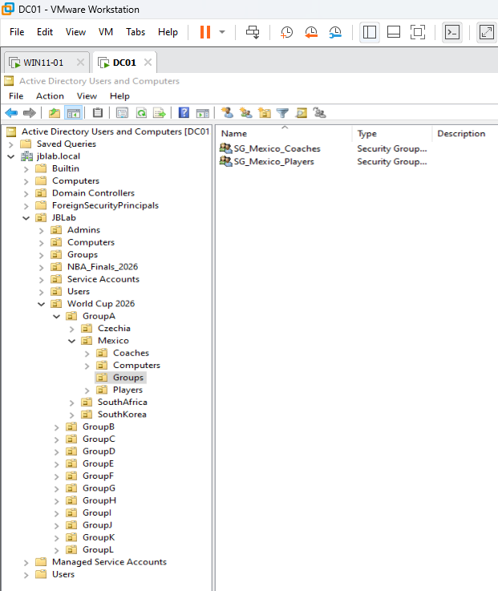

# Enterprise Windows Infrastructure Project

> Active Directory Automation & Infrastructure Case Study

Enterprise Windows infrastructure project built using **Windows Server 2022**, **Active Directory Domain Services**, **PowerShell**, **Group Policy**, and **VMware Workstation Pro** to simulate a real-world enterprise environment. The project emphasizes infrastructure automation, identity management, centralized administration, and Windows security through a FIFA World Cup-themed business scenario.

---

## Enterprise Architecture


---

## Project Overview

Rather than following isolated tutorials, this project was designed as an end-to-end enterprise deployment to strengthen practical Windows Systems Administration skills.

The environment simulates how enterprise administrators design Active Directory, automate user provisioning, implement role-based security, deploy Group Policy, configure file services, and troubleshoot infrastructure issues in production environments.

The project uses a **World Cup 2026** organizational structure as the business scenario while focusing on enterprise infrastructure concepts and automation.

---

## Lab Environment

| Component | Technology |
|-----------|------------|
| Hypervisor | VMware Workstation Pro |
| Server | Windows Server 2022 |
| Client | Windows 11 Pro |
| Domain | `jblab.local` |
| Directory Services | Active Directory Domain Services |
| Automation | PowerShell + CSV |
| Security | RBAC, NTFS Permissions |
| File Services | SMB Shares |
| Policy Management | Group Policy |

---

## Enterprise OU Design

The Active Directory environment is organized using a scalable Organizational Unit (OU) hierarchy that separates administrative objects from business units.

```
jblab.local
│
└── JBLab
    ├── Admins
    ├── Computers
    ├── Groups
    ├── NBA_Finals_2026
    ├── Service Accounts
    ├── Users
    └── World Cup 2026
         ├── GroupA
         ├── GroupB
         ├── ...
         └── GroupL
```

Each competition group contains country-specific Organizational Units representing participating national teams, allowing delegated administration and structured policy application.

## Enterprise OU Design

The Active Directory environment is organized using a scalable Organizational Unit (OU) hierarchy that separates administrative objects from business units.

<ASCII Tree>

Each competition group contains country-specific Organizational Units representing participating national teams, allowing delegated administration and structured policy application.

---

### Active Directory Implementation

#### Domain Overview



**Description**

The root Active Directory domain (`jblab.local`) serves as the foundation of the enterprise environment.

---

#### JBLab Organizational Unit


**Description**

The `JBLab` OU contains the administrative structure of the environment, including dedicated OUs for users, computers, groups, service accounts, and business units.

---

#### World Cup Business Unit



**Description**

The `World Cup 2026` OU models a business unit, organized into Groups A–L, each containing country-specific Organizational Units.

---

#### Coaches Organizational Unit



**Description**

Coach accounts are separated into their own Organizational Units to demonstrate structured identity management and delegated administration.

---

#### Security Groups



**Description**

Role-Based Access Control (RBAC) is implemented using Active Directory Security Groups to simplify permission management and support least-privilege access.

---

## Project Objectives

- Design a scalable Active Directory infrastructure
- Automate user provisioning with PowerShell
- Import users using CSV datasets
- Implement Role-Based Access Control (RBAC)
- Configure SMB file shares
- Apply NTFS permissions
- Deploy Group Policy Objects (GPOs)
- Validate end-user access
- Troubleshoot enterprise administration scenarios

---

## PowerShell Automation

PowerShell was used extensively throughout the project to automate repetitive administrative tasks.

Automation includes:

- Organizational Unit creation
- User provisioning
- Security Group creation
- CSV imports
- SMB Share creation
- NTFS Permission assignment
- Coach account deployment
- Featured Player account deployment

---

## Technologies Used

- Windows Server 2022
- Windows 11 Pro
- Active Directory Domain Services
- DNS
- PowerShell
- CSV Automation
- VMware Workstation Pro
- SMB File Services
- NTFS Permissions
- Group Policy
- Role-Based Access Control (RBAC)

---

## Repository Structure

```
enterprise-windows-infrastructure-project
│
├── architecture/
├── assets/
├── case-study/
├── csv/
├── docs/
├── images/
└── scripts/
```

---

## Skills Demonstrated

- Active Directory Administration
- Windows Server Administration
- Infrastructure Automation
- PowerShell Scripting
- Identity Management
- Role-Based Access Control (RBAC)
- Group Policy Management
- SMB File Services
- NTFS Permissions
- Enterprise Troubleshooting
- Technical Documentation

---

## Future Enhancements

Planned improvements include:

- Hybrid Microsoft Entra ID
- Azure AD Connect
- Microsoft Intune
- Microsoft Defender for Endpoint
- Microsoft Sentinel
- Active Directory Certificate Services (AD CS)
- Windows Server Failover Clustering
- DFS Namespace and Replication

---

## Author

**Jameel B**

Windows Systems Administrator passionate about enterprise infrastructure, automation, and modern endpoint management.

This repository documents my ongoing journey from Windows Systems Administration toward Systems Engineering through practical, hands-on projects.
